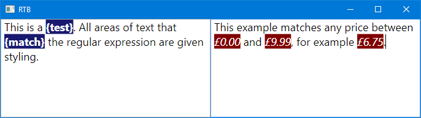

# RichTextBoxRegexMatchBehaviour
A behaviour for a WPF `RichTextBox` that disables all user styling and instead applies custom styling to any text in the document that matches a regular expression.

    public sealed class RichTextBoxRegexMatchBehaviour : Behavior<RichTextBox>

The behaviour can be found in [Behaviours/RichTextBoxRegexMatchBehaviour.cs](Behaviours/RichTextBoxRegexMatchBehaviour.cs).

## Example
The following example has two separate `RichTextBox`es and can be recreated using the [Example.xaml](Example.xaml) file.

## Performance
This behaviour has been designed with performance in mind, avoiding expensive methods such as `TextRange.ClearAllProperties()` to enable it to run seamlessly in most scenarios. There is a limit, however, to the speed at which the document can be rebuilt and the regular expression engine can check the document for matches. In any situation where running the matching/restyling process immediately any time text is changed is not desired, there are two options:

 1. The `TextChangedDelayProperty` can be set to a value *greater than zero* to delay processing until the user has stopped making changes to the document for the specified number of milliseconds.

 2. The `TextChangedDelayProperty` can be set to any value *less than zero* (e.g. -1) to disable automatic restyling altogether. The `RestyleDocument()` method can then be called to manually process the document whenever desired. (This method also works when the value is non-negative).

## Properties
 - `RegexPatternProperty` (`string`) - The regular expression pattern used to search for areas of the document to style.
 
 - `RegexOptionsProperty` (`RegexOptions`) - Options for the regular expression engine.
 
 - `PropertyValuesProperty` (`PropertyValue[]`) - The properties and their values that are applied to the sections of the document that match the regular expression.
 
 - `TextChangedDelayProperty` (`int`) - The minimum time (in milliseconds) after the last `TextChanged` event before the styling will be updated. Setting this property to zero will cause the document to be restyled immediately after each change to the document. Increasing this value can help improve performance on slower systems or larger documents where updating frequently is not desired.

## Notes
The required `System.Windows.Interactivity` namespace can be found in the [`System.Windows.Interactivity.WPF` NuGet package](https://www.nuget.org/packages/System.Windows.Interactivity.WPF).
